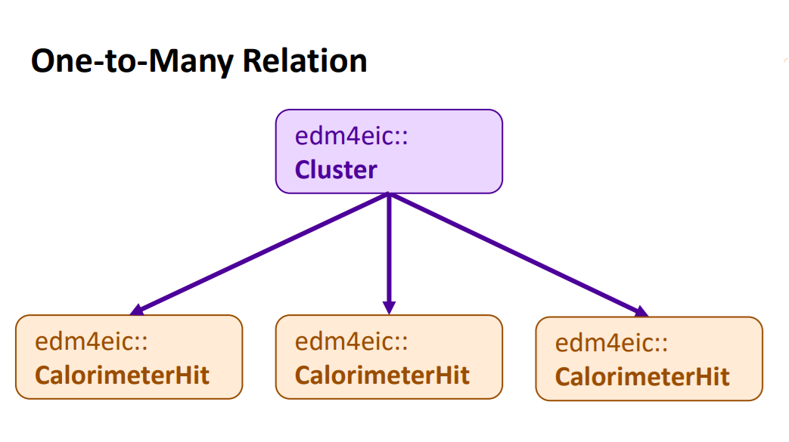
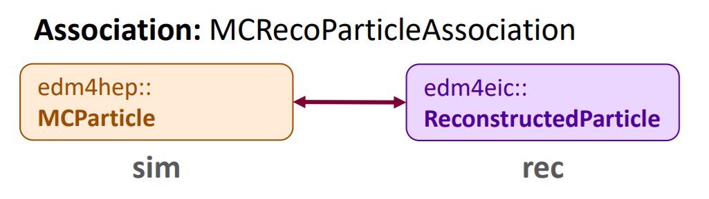

::::::::::::::::::::::::::::::::::::::::::::: questions

- What is our data model?
- What is PODIO?
- How do I interface with our data model?

:::::::::::::::::::::::::::::::::::::::::::::

::::::::::::::::::::::::::::::::::::::::::::: objectives

- Understand relationship between the data model and PODIO
- Become familiar with PODIO concepts and synatx

:::::::::::::::::::::::::::::::::::::::::::::

## The EDM4eic Data Model

A _data model_ is how we represent our data in our software.  In other words, a standardized
set of data structures that we use to pass information between different parts of our
software stack (DD4hep, EICrecon, etc.) and between different algorithms in those parts.

{alt='Boxes for each EDM4eic data structure connected by arrows indicating their relations'}

Our data model is [EDM4eic][edm4eic] (**E**vent **D**ata **M**odel for EIC), and is summarized
in the above figure.  Each box corresponds to a data structure, and the arrows correspond to
connections between these structures.  The entire model is defined in a single YAML file,
[edm4eic.yaml][eicyaml], which we'll break down in detail below.

::::::::::::::::::::::::::::::::::::::::::::: challenge

## Exercise

Take a moment to scan the figure, paying attention to the names of structures.  Then pick
a structure and find it in the YAML file mentioned above: notice how the arrows correspond
to the fields labeled `OneToOneRelations` or `OneToManyRelations`. 


:::::::::::::::  solution

For example, `edm4eic::Cluster` has one-to-many relations to `edm4eic::CalorimeterHit`
(the hits combined to form the cluster), to other `edm4eic::Cluster`s, and to
`edm4hep::ParticleID`.  Each of these corresponds to an arrow leaving the cluster box
in the figure.

:::::::::::::::

:::::::::::::::::::::::::::::::::::::::::::::

A few things comments before we move on:

- Using a _standardized_ set of structures helps keep our software _modular_, meaning we
  can easily swap out parts, since all our data adheres to standardized interfaces;
- The data model does _not_ say anything about input/output formats: we write our data
  using ROOT, but we could also write it in other formats like HDF5;
- And we want our model to be _predictable_ and _intuitive_: accessing the energy of
  a calorimeter cluster should be identical to accessing the energy of a particle.

::::::::::::::::::::::::::::::::::::::::::::: callout

## Note

We also utilize the [EDM4hep][edm4hep] data model in our software.  This is a data model
developed by the [Key4hep][key4hep] project, which is developing common software to support
the FCC, ILC/CLIC, Muon Collider, and more.  Just like with our data model, the EDM4hep
model is also defined in a single YAML file, [edm4hep.yaml][hepyaml]. 

:::::::::::::::::::::::::::::::::::::::::::::

## An Introduction to PODIO

So then what's PODIO? [PODIO][podio] (**P**lain-**O**ld-**D**ata **I**nput/**O**utput) is
a toolkit for _generating_ and _managing_ a data model like EDM4eic.  It reads in a YAML
file like edm4eic.yaml and generates all the C++ and Python code needed to read, write, and
interface with the structures defined in there.

### Classes

Let's look at one of these structures:

```yaml
edm4eic::Track:
  Description: "Track information at the vertex"
  Author: "S. Joosten, J. Osborn"
  Members:
    - int32_t           type                       // Flag that defines the type of track
    - edm4hep::Vector3f position                   // Track 3-position at the vertex 
    - edm4hep::Vector3f momentum                   // Track 3-momentum at the vertex [GeV]
    - edm4eic::Cov6f    positionMomentumCovariance // Covariance matrix in basis [x,y,z,px,py,pz]
    - float             time                       // Track time at the vertex [ns]
    - float             timeError                  // Error on the track vertex time
    - float             charge                     // Particle charge
    - float             chi2                       // Total chi2
    - uint32_t          ndf                        // Number of degrees of freedom
    - int32_t           pdg                        // PDG particle ID hypothesis
  OneToOneRelations:
    - edm4eic::Trajectory trajectory // Trajectory of this track
  OneToManyRelations:
    - edm4eic::Measurement2D measurements // Measurements that were used for this track
    - edm4eic::Track         tracks       // Tracks (segments) that have been
      // combined to create this track
```

This is an example of a _class_.  At the top of the definition, we see some basic info like
the name of the structure, a brief description, and the authors.  Following this, we see a
block labeled `Members`.  These are your basic class members.  Suppose we have an `edm4eic::Track`
named `track`, how would we access its members?

```python
# getting data members
trk_time = track.getTime()
trk_ndf  = track.getNdf()

# setting data members
track.setCharge(-1.0)
track.setPDG(11)
```

Or in C++:

```c++
// getting data members
float    trk_time = track.getTime();
uint32_t trk_ndf  = track.getNdf();

// setting data members
track.setCharge(-1.0);
track.setPDG(11);
```

This already highlights of the big advantages of using PODIO to work with our data: the
interface is almost identical between C++ and Python.  We'll see where they diverge in
later sections.

Wait! But how would I know that the accessors start with `get` or `set`?
  1. First, look at the top of the YAML file: you'll notice under options that `getSyntax`
     is set to `true`.  This means that the accessor functions for class members will
     _always_ start with `get`/`set`, letting you _infer_ what the relevant functions are
     from the YAML.
  2. You can also look at the generated classes on our [EDM4eic doxygen page][eicdoc]. Or
     while you're in eic-shell, you can look at them in the path `/opt/local/include/edm4eic`.

::::::::::::::::::::::::::::::::::::::::::::: challenge

## Exercise

Follow the link to [the doxygen page][eicdoc], and locate the header file for `edm4eic::Track`.
Once you found it, give it a quick scan.  Then in eic-shell, find the same header file and
compare it to the online version.


:::::::::::::::  solution

On the doxygen page, the header is listed under `edm4eic/Track.h`.  In eic-shell, the
same file is at `/opt/local/include/edm4eic/Track.h` — you can view it with, e.g.,
`less /opt/local/include/edm4eic/Track.h`.  You'll find the same `getTime()`, `getNdf()`,
etc. accessors that the YAML file implies.

:::::::::::::::

:::::::::::::::::::::::::::::::::::::::::::::

### Collections and Frames

For reading in/writing out classes, they'll need to be placed in a _collection_.  Collections
can be thought of as almost (but not quite!) a c++ `std::vector` or Python list of objects.
Iterating through their contents looks like you'd expect for either of those containers:

```python
tracks = frame.get("CentralCKFTracks")
for track in tracks:
    chi2_ndf = track.getChi2() / track.getNdf()
```

Or:

```c++
auto& tracks = frame.get<edm4eic::TrackCollection>("CentralCKFTracks");
for (const auto& track : tracks) {
  chi2_ndf = track.getChi2() / track.getNdf();
}
```

The `frame` in the above snippets is a `Frame`, which holds and organizes several
collections.  We'll see frames and collections in action in the following episodes.
However, a detailed explanation of their usage is outside the scope of this tutorial.

::::::::::::::::::::::::::::::::::::::::::::: caution

## Warning

The big thing to note here is that collections are **read-only**!  This means that
you _can't_ modify an object you are reading from a collection!

:::::::::::::::::::::::::::::::::::::::::::::

### Components

Notice that the position and momentum of the track are stored as an `edm4hep::Vector3f`.
This is an example of a _component_.  Let's look at the definition:

```yaml
edm4hep::Vector3f:
  Members:
    - float x
    - float y
    - float z
  ExtraCode:
    includes: "#include <cstddef>"
    declaration: |
      constexpr Vector3f() : x(0),y(0),z(0) {}
      constexpr Vector3f(float xx, float yy, float zz) : x(xx),y(yy),z(zz) {}
      constexpr Vector3f(const float* v) : x(v[0]),y(v[1]),z(v[2]) {}
      constexpr bool operator==(const Vector3f& v) const { return (x==v.x&&y==v.y&&z==v.z) ; }
      constexpr bool operator!=(const Vector3f& v) const { return !(*this == v) ; }
      constexpr float operator[](unsigned i) const {
        static_assert(
          (offsetof(Vector3f,x)+sizeof(Vector3f::x) == offsetof(Vector3f,y)) &&
          (offsetof(Vector3f,y)+sizeof(Vector3f::y) == offsetof(Vector3f,z)),
          "operator[] requires no padding");
        return *( &x + i ) ;
      }
```

It has 3 data members and some extra code, which just defines some handy functions.  If you
find this in [edm4hep.yaml][hepyaml], then you'll notice it's defined under a block labeled
`components`.  Notice that `edm4eic::Track` is defined under a block labeled `classes`.

Components are just simple `struct`s (in the C++ sense).  This means that component accessors
are _not_ prefixed by `get`/`set`.  For example:

```python
import math
px = track.getMomentum().x
py = track.getMomentum().y
pt = math.hypot(px, py)
```

Or:

```c++
#include <cmath>
float px = track.getMomentum().x;
float py = track.getMomentum().y;
float pt = std::hypot(px, py);
```

Also note that components can't be stored in a collection and so can't be written out
_except_ as part of a class such as `edm4eic::Track`.

### Vector Members

Let's look at the definition of a calorimeter cluster:

```yaml
edm4eic::Cluster:
  Description: "EIC hit cluster, reworked to more closely resemble EDM4hep"
  Author: "W. Armstrong, S. Joosten, C.Peng"
  Members:
    - int32_t              type                         // Flag-word that defines the
      // type of the cluster
    - float                energy                       // Reconstructed energy of the
      // cluster [GeV].
    - float                energyError                  // Error on the cluster energy [GeV]
    - float                time                         // [ns]
    - float                timeError                    // Error on the cluster time
    - uint32_t             nhits                        // Number of hits in the cluster.
    - edm4hep::Vector3f    position                     // Global position of the cluster [mm].
    - edm4eic::Cov3f       positionError                // Covariance matrix of the
      // position (6 Parameters).
    - float                radius                       // Cluster radius [mm].
    - float                dispersion                   // Cluster dispersion [mm].
    - std::array<float, 3> principalAxesLengthsXYZ      // Lengths along the cluster's principal
      // axes [mm], sorted in descending order (equivalent to sqrt of eigenvalues of the position
      // covariance). For an XY planar detector one can expect this to be [sigma_max, sigma_min, 0].
    - std::array<float, 2> principalAxesLengthsThetaPhi // Lengths along the cluster's principal
      // axes [rad], sorted in descending order.
    - float                intrinsicTheta               // Intrinsic cluster propagation
      // direction polar angle [rad].
    - float                intrinsicPhi                 // Intrinsic cluster propagation direction
      // azimuthal angle [rad]. For an XY planar detector one can expect this to be the tilt of
      // "sigma_max" axis.
    - edm4eic::Cov2f        intrinsicDirectionError // Error on the intrinsic cluster
      // propagation direction
  VectorMembers:
    - float shapeParameters     // [DEPRECATED] use radius, dispersion,
      // principalAxesLengthsXYZ/ThetaPhi instead.
    - float hitContributions    // Energy contributions of the hits. Runs parallel to ::hits()
    - float subdetectorEnergies // Energies observed in each subdetector used for this cluster.
  OneToManyRelations:
    - edm4eic::Cluster        clusters    // Clusters that have been combined to form this cluster
    - edm4eic::CalorimeterHit hits        // Hits that have been combined to form this cluster
    - edm4hep::ParticleID     particleIDs // Particle IDs sorted by likelihood
```

You'll see a block labeled `VectorMembers`. These are just `std::vector`s of data.  For
example, `hitContributions` holds the weighted energy of the calorimeter cells (a.k.a _hits_)
that make up a given cluster.

The accessors are the same as for normal members, except they'll return a `std::vector`
(C++) or `List` (Python).  Suppose we have an `edm4eic::Cluster` named `cluster`:

```python
total_energy = 0.0
for weighted_energy in cluster.getHitContributions():
    total_energy += weighted_energy
```

Or:

```c++
float total_energy = 0.0;
for (const float weighted_energy : cluster.getHitContributions()) {
  total_energy += weighted_energy;
}
```

### Relations

Now, let's consider the `OneToOneRelations` and `OneToManyRelations` blocks.  These
are examples of _relations_, references to objects in other collections.  We use
these to define a direct, _necessary_ relationship between an object and one other
object (one-to-one) or many other objects (one-to-many).

{alt='A track pointing to the single trajectory it was computed from'}

The above figure schematically illustrates a one-to-one relation.  A _track_ should
correspond to a charged particle with a defined momentum and charge.  It's computed
from a _trajectory_, a path fit to a set of points from our trackers.  This
relationship is expressed in the one-to-one relation from our `edm4eic::Track` to
an `edm4eic::Trajectory`.

Retrieving the object from a relation is done the same way you would get a value
from a member:

```python
trajectory    = track.getTrajectory()
n_points_used = trajectory.getNMeasurements()
```

Or:

```C++
auto     trajectory    = track.getTrajectory();
uint32_t n_points_used = trajectory.getNMeasurements();
```

{alt='A calorimeter cluster pointing to the several calorimeter hits it is built from'}

Then the above figure schematically illustrates a one-to-many relation.  For example,
a calorimeter cluster is group of calorimeter cells (hits).  The cells that make up a
given cluster are recorded in its one-to-many relation to `edm4eic::CalorimeterHit`s.

Objects referred to in a one-to-many relation are retrieved like you'd expect:

```python
for hit in cluster.getHits():
    energy = hit.getEnergy()
```

Or:

```c++
for (const auto& hit : cluster.getHits()) {
  double energy = hit.getEnergy();
}
```

When you call `getHits()` in the above snippets, it returns a `List` (Python)
or `std::vector` (C++) of `edm4eic::CalorimeterHit`s just like with vector
members.

## Associations/Links

In contrast to relations, which express a direct connection between two or more
objects, _associations_ express an indirect connection which might or might not
exist.  For example, the connection between a monte carlo particle and its
reconstructed counterpart:

{alt='An association object connecting a simulated particle and a reconstructed particle'}

This is defined in edm4eic.yaml as:

```yaml
edm4eic::MCRecoParticleAssociation:
  Description: "Used to keep track of the correspondence between MC and reconstructed particles"
  Author: "S. Joosten"
  Members:
    - float weight // weight of this association
  OneToOneRelations:
    - edm4eic::ReconstructedParticle rec  // reference to the reconstructed particle
    - edm4hep::MCParticle            sim  // reference to the Monte-Carlo particle
  ExtraCode:
    includes: "
    #include <edm4eic/ReconstructedParticle.h>\n
    #include <edm4hep/MCParticle.h>\n
    "
    declaration: "
    [[deprecated(\"use getSim().getObjectID().index instead\")]]
    int getSimID() const { return getSim().getObjectID().index; }\n
    [[deprecated(\"use getRec().getObjectID().index instead\")]]
    int getRecID() const { return getRec().getObjectID().index; }\n
      "
```

The `weight` here is nominally a measure of the goodness of the correspondence between the
reconstructed and MC particles, and the `rec` and `sim` fields store the references to
the corresponding particles.  Let's assume we have an `edm4eic::MCRecoParticleAssociation`
called `assoc`.  Accessing its members is exactly like you'd expect:

```python
rec_par = assoc.getRec()
sim_par = assoc.getSim()
weight  = assoc.getWeight()
e_frac  = (sim_par.getEnergy() - rec_par.getEnergy()) / sim_par.getEnergy()
```

Or:

```c++
auto  rec_par = assoc.getRec();
auto  sim_par = assoc.getSim();
float weight  = assoc.getWeight();
float e_frac  = (sim_par.getEnergy() - rec_par.getEnergy()) / sim_par.getEnergy();
```

Now let's consider the equivalent link:

```yaml

edm4eic::MCRecoParticleLink:
  Description: "Used to keep track of the correspondence between MC and reconstructed particles"
  Author: "S. Joosten"
  From: edm4eic::ReconstructedParticle
  To: edm4hep::MCParticle
```

There's a lot less!  _Links_ are defined in their own specific block (labeled `links`), and only
need you to specify which types they're connecting (`edm4eic::ReconstructedParticle` and
`edm4hep::MCParticle` in this case).

{alt='A link object pointing from a reconstructed particle to a simulated particle'}

They provide the same functionality as association, but there are a few key differences:

1. Links _always_ have the same fields: `from`, `to`, and `weight` (which is implied);
2. And they have _directionality_ (illustrated in the above figure).

Point 1 means the accessors will always be the same for any link.  The link equivalents of
the above snippets are:

```python
rec_par = link.getFrom()
sim_par = link.getTo()
weight  = link.getWeight()
e_frac  = (sim_par.getEnergy() - rec_par.getEnergy()) / sim_par.getEnergy()
```

And:

```c++
auto  rec_par = link.getFrom();
auto  sim_par = link.getTo();
float weight  = link.getWeight();
float e_frac  = (sim_par.getEnergy() - rec_par.getEnergy()) / sim_par.getEnergy();
```

The directionality comes into play with the `podio::LinkNavigator`, which enables
extremely fast lookup of linked objects.  This is, however, outside the scope
of this tutorial.


::::::::::::::::::::::::::::::::::::::::::::: caution

## Warning

We're in the process of deprecating of associations in favor of links (EDM4hep
has already done this).  Currently we write out both associations and their
equivalent links where needed to not break analysis code.  However, we will
in the near future remove associations and write out only links

:::::::::::::::::::::::::::::::::::::::::::::

## User vs. Storage Layer

Lastly, try opening the file we downloaded during Setup with a ROOT TBrowser:

```bash
$ root --web-display=off lAger3.6.1-1.0_jpsi_10x130_hiAcc_run1.0009.eicrecon.edm4eic.root
root [0] new TBrowser()
```

Open the tree labeled `events` and you'll see hundreds of branches!  Find the
branch labeled `CentralCKFTracks`, open it and click on a few leaves.  This is
how PODIO data is organized in memory, as a big array of structs holding the
values in the leaves.  This is referred to as _the POD (or Data) Layer_.

As noted in the last section, the [Analysis Tutorial][analysis] illustrates
how to work directly with the POD Layer using a ROOT `TTreeReader`.  The syntax
illustrated above is working with what's called _the User Layer_, a think layer
of interfaces to make working with the data easy.  A third layer, _the Object
Layer_, interfaces between the POD and User Layers.

There are clear benefits to working with the User Layer over the POD Layer:

- Significantly less boilerplate code to write,
- Easy, intuitive syntax to deal with relations, associations, and vector
  members; and
- The User Layer synatx will remain constant, but how the POD Layer is 
  organized _may not._

The first two points will be illustrated very clearly in the following
episodes.  However, there may be cases where working directly with the 
POD Layer is actually preferable.  For example:

- You may want to histogram just one or two members directly, or
- You're working with a ML pipeline where you'll need to load the data
  as a dataframe.

Which analysis method is ultimately up to you: our goal is to support
as many methods as possible, and, between the POD Layer and the User
Layer, PODIO gives us the tools to do that.

## References

- [EDM4eic][edm4eic]
- [EDM4eic YAML File][eicyaml]
- [EDM4hep][edm4hep]
- [Key4hep Project][key4hep]
- [EDM4hep YAML File][hepyaml]
- [PODIO][podio]
- [EDM4eic Doxygen][eicdoc]
- [PODIO Documentation][poddoc]
- [Link Navigator Documentation][navigator]
- [Analysis Tutorial][analysis]

[edm4eic]: https://github.com/eic/EDM4eic
[eicyaml]: https://github.com/eic/EDM4eic/blob/main/edm4eic.yaml
[edm4hep]: https://github.com/key4hep/EDM4hep
[key4hep]: https://github.com/key4hep
[hepyaml]: https://github.com/key4hep/EDM4hep/blob/main/edm4hep.yaml
[podio]: https://github.com/AIDASoft/podio
[eicdoc]: https://eic.github.io/EDM4eic/
[poddoc]: https://key4hep.web.cern.ch/podio/index.html
[navigator]: https://key4hep.web.cern.ch/podio/links.html#the-linknavigator-utility
[analysis]: https://eic.github.io/tutorial-analysis/

::::::::::::::::::::::::::::::::::::::::::::: keypoints

- A data model is how represent our data in software
- PODIO is a toolkit to generate and interface with data models like EDM4eic
- Classes have their accessors prefixed by get/set, components don't
- Relations are references to objects in other collections
- Associations/links define indirect connections between objects

:::::::::::::::::::::::::::::::::::::::::::::
