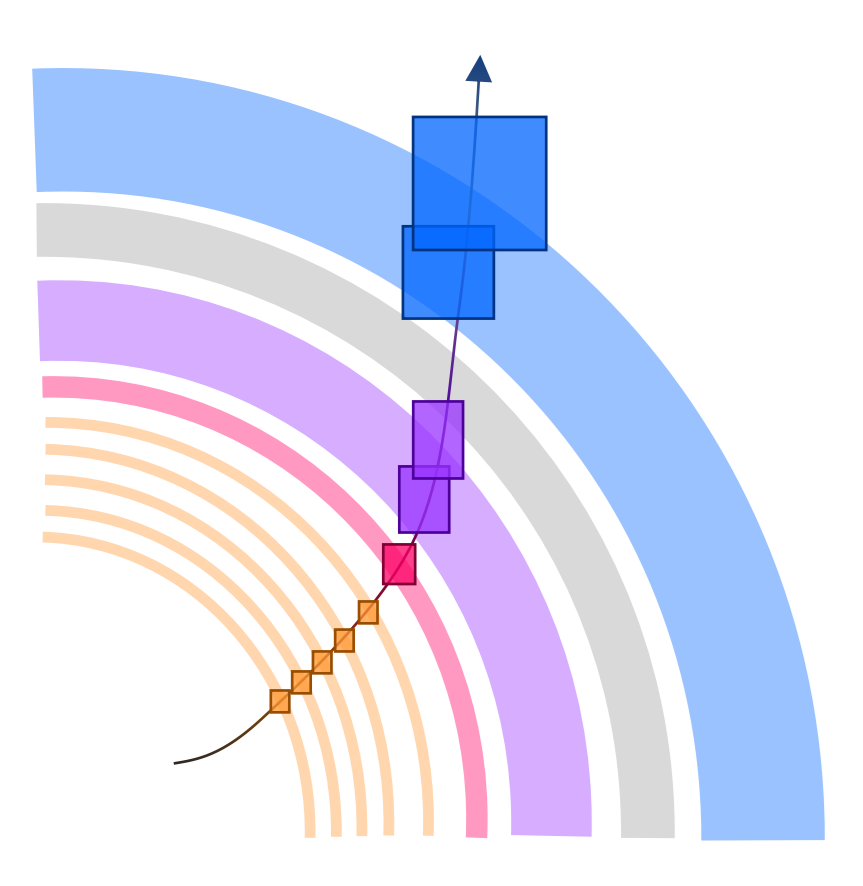
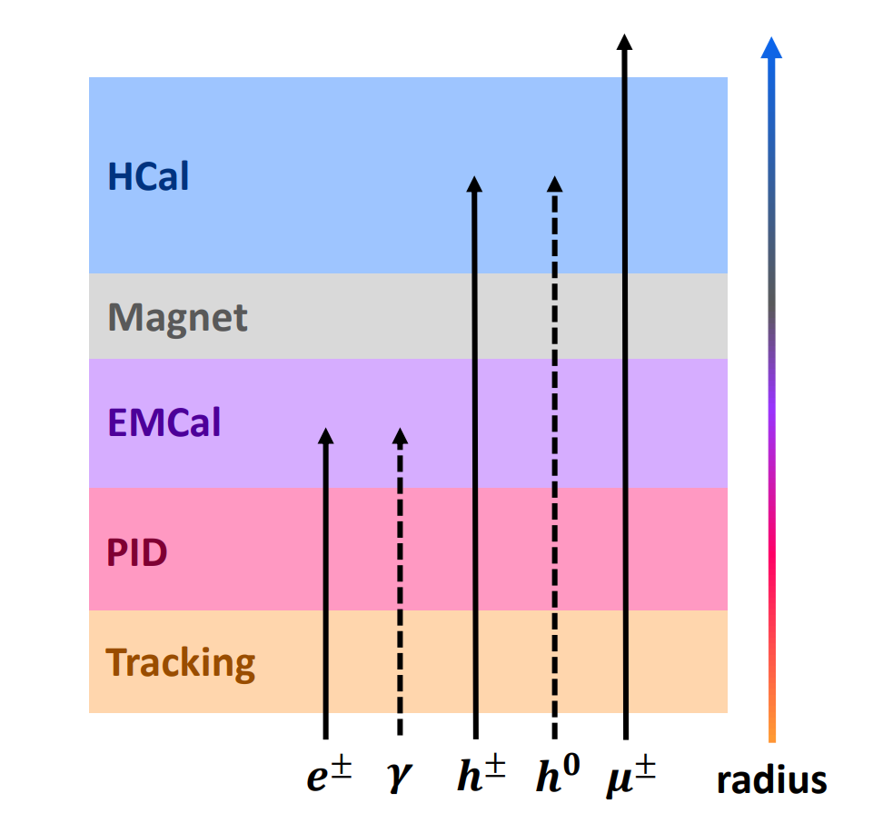

Like we noted in the Setup section, our goal in this tutorial is to understand how to use
the PODIO interface in an analysis.  As such, this tutorial will build on the earlier
[Analysis Tutorial][analysis], which discussed how to analyze our reconstruction output with
the ROOT [TTreeReader][reader] and [RDataFrame][dataframe].

Our vehicle for doing so will be two commmon and complementary analysis routines:

1. Matching tracks and clusters; and
2. Matching decay products to their parents.

On one hand, the former utilizes purely reconstructed objects (tracks and clusters) and will
illustrate the basics of PODIO and _links_.  While on the other hand, the latter utilizes purely
simulated objects (generated particles) and will illustrate how to navigate _relations_.

We'll deploy these routines to study $J/\psi$s decaying to $e^{+} + e^{-}$ pairs, a common
decay channel used in many areas of EIC science.

## Why these?

Before diving into PODIO, though, I would like to motivate _why_ you should care about these
two routines.  To start, remember that a particle is _not_ just a track, a cluster, or so
on.  A particle will leave signals in several detectors.  The majority of particles in a
typical DIS event will create hits in our trackers _and_ will shower --- forming a cluster
--- in at least one of our calorimeters.

This is illustrated in the following image, where the colored bands indicate the tracking
layers (orange), cherenkov detector (pink), electromagnetic calorimeter (ECal, purple),
magnet  solenoid (grey), and hadronic calorimeter (HCal, blue) in ePIC's barrel.

Accurately reconstructing the particle --- its momentum, energy, charge, mass --- will require
us to make use of all of this information.  For example, an electron will create a track and will
usually deposit all of its energy into an ECal.  In contrast, a charged hadron  like a $\pi^{-}$),
will frequently deposit energy into HCal, while a $\pi^{0}$ will deposit energy into an ECal without
creating a track.  This is illustrated in the following figure.

Therefore, track-cluster matching is a critical step in our reconstruction, which we use to
identify leptons, measure neutral particles, and more.  In this tutorial, we'll use it identify
decay $e^{\pm}$ which we'll reconstruct a $J/\psi$ from.

To validate our reconstructed $J/\psi$, however, we'll need to identify the corresponding
simulated particles.  That's where parent-daughter comes in. 

<!-- Links --!>

[analysis]: https://eic.github.io/tutorial-analysis
[reader]: https://root.cern.ch/doc/master/classTTreeReader.html
[dataframe]: https://root.cern/doc/master/classROOT_1_1RDataFrame.html


