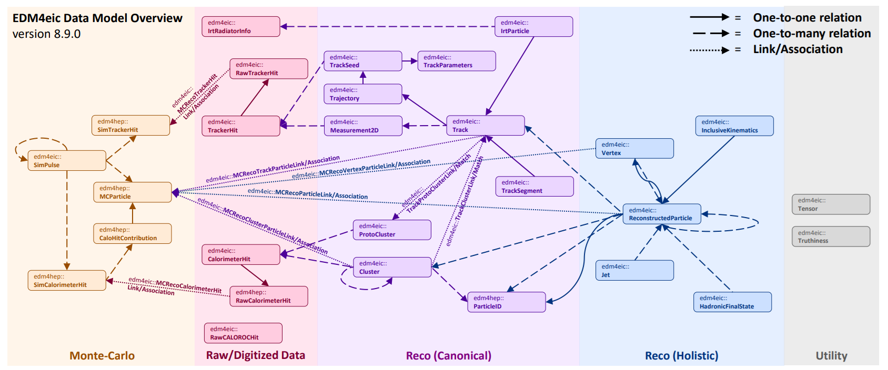
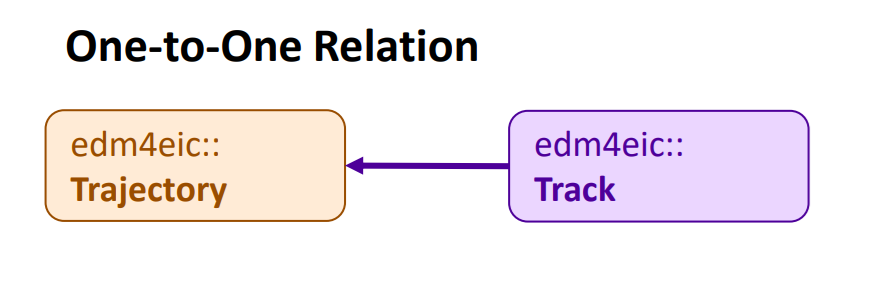
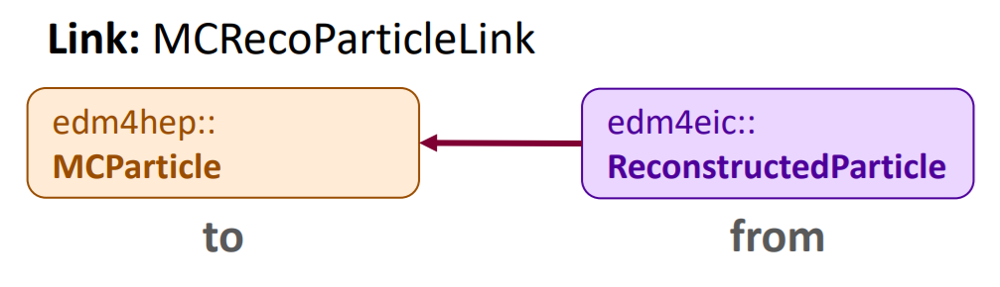

## The EDM4eic Data Model

A _data model_ is how we represent our data in our software.  In other words, a standardized
set of data structures that we use to pass information between different parts of our
software stack (DD4hep, EICrecon, etc.) and between different algorithms in those parts.

Our data model is [EDM4eic][edm4eic] (**E**vent **D**ata **M**model for EIC), and is summarized
in the above figure.  Each box corresponds to a data structure, and the arrows correspond to
connections between these structures.  The entire model is defined in a single YAML file,
[edm4eic.yaml][eicyaml], which we'll break down in detail below.

> Exercise
> Take a moment to scan the figure, paying attention to the names of structures.  Then pick
> a structure and find it in the YAML file mentioned above: notice how the arrows correspond
> to the fields labeled `OneToOneRelations` or `OneToManyRelations`. 
{: .challenge}

A few things to note before we move on:
- Using a _standardized_ set of structures helps keep our software _modular_, meaning we
  can easily swap out parts, since all our data adheres to standardized interfaces;
- The data model does _not_ say anything about input/output formats: we write our data
  using ROOT, but we could also write it in other formats like HDF5;
- And we want our model to be _predictable_ and _intuitive_: accessing the energy of
  a calorimeter cluster should be identical to accessing the energy of a particle.

> Note that we also utilize the [EDM4hep][edm4hep] data model in our software.  This is a
> data model developed by the [Key4hep][key4hep] project, which is developing common software
> to support the FCC, ILC/CLIC, Muon Collider, and more.  Just like with our data model, the
> EDM4hep is defined a single YAML file, [edm4hep.yaml][hepyaml]. 
{: .callout}

## An Introduction to PODIO

PODIO IS A TOOLKIT TO GENERATE AND INTERFACE WITH DATA MODELS LIKE
EDM4EIC. IT TAKES THAT YAML FILE AND TURNS IT INTO ALL OF THE C++
CODE YOU NEED.

POINTS TO HIT:
- STORAGE VS USER LAYER
- COLLECTIONS (READ-ONLY)
- COMPONENTS VS CLASSES
- MEMBERS AND VECTOR MEMBERS
- use getX, setX
- DOXYGEN PAGE

## Relations

RELATIONS DIRECTLY CONNECT ONE OBJECT TO ANOTHER.

### One-to-One Relations

NAME SAYS IT ALL

### One-to-Many Relations

NAME SAYS IT ALL

## Links/Associations

LINKS AND ASSOCIATIONS CONNECT DISPARATE OJECTS. THESE CONNECTIONS
MAY OR MAY NOT EXIST. LINKS HAVE DIRECTIONALITY, ASSOCIATIONS DON'T.
ASSOCIATIONS ARE BEING DEPRECATED.

LINKS HAVE A LOT OF BENEFITS SUCH AS MORE CONSISTENT SYNTAX. AND
YOU HAVE THE LINK NAVIGATOR WHICH IS OUT-OF-THE-SCOPE OF THIS TUTORIAL.

## References

[podio]: https://github.com/AIDASoft/podio
[edm4eic]: https://github.com/eic/EDM4eic
[eicyaml]: https://github.com/eic/EDM4eic/blob/main/edm4eic.yaml
[edm4hep]: https://github.com/key4hep/EDM4hep
[key4hep]: https://github.com/key4hep
[hepyaml]: https://github.com/key4hep/EDM4hep/blob/main/edm4hep.yaml

## Outline

Key points:
  - Illustrate basics of PODIO usage in
    C++, Python
  - Illustrate navigating links, associations,
    and relations

Skeleton:

2. PODIO
    - Framework for generating, managing EDMs
    - Defined in a .yml file (include link)
    - Navigating the model:
      - Example: Cluster
        - Explanation of fields, "guessing" the
          setter/getters
        - Note: doxygen and /opt/include
      - Example: Track
      - Example: MCParticle 
    - Relations: "adjacent" connections between
      objects
      - Encode "causal" connections
      - Or "combinatorial" connections
    - Links/Associations: "orthogonal" connections
      - Encodes connections which may (or may not)
        be present


